# Amazon Connect SMB Starter Kit

## Introduction
This document provides an implementation guide for deploying a customer service contact centre solution powered by Amazon Connect and enhanced with Amazon Q's AI capabilities.   By following this guide, you will deploy a fully functional, customer experience solution that enables voice, chat, and messaging interactions. 

This AWS SMB starter kit includes a CloudFormation template that simplifies the deployment process and demonstrates how Amazon Connect leverages generative AI to provide customer self-service capabilities. The solution is particularly valuable for small and medium-sized businesses seeking to implement enterprise-grade, AI-enhanced customer service capabilities with minimal configuration requirements.

 
## Architecture overview
The architecture for this Amazon Connect solution consists of the following key components: 
1.	[Amazon Connect](https://docs.aws.amazon.com/connect/latest/adminguide/connect-feature-overview.html) - The core service providing Contact Centre capabilities to interact with customers
2.	[Amazon Q in Connect](https://docs.aws.amazon.com/connect/latest/adminguide/amazon-q-connect.html) - The core service providing the generative AI capabilities to answer questions based on the enterprise data
3.	[Amazon S3](https://docs.aws.amazon.com/AmazonS3/latest/userguide/Welcome.html) – Storage capability to house documentation accessed by Amazon Q and host a static webpage.
4.	[CloudFront](https://aws.amazon.com/cloudfront/) – A Content Distribution Network capability to present customer facing website.

NOTE: The solution is designed to be deployed in regions where Amazon Connect and Amazon Q services are available. Please verify service availability in your preferred region before deployment. https://docs.aws.amazon.com/connect/latest/adminguide/regions.html 

 

## Customer Journey
1. User navigates to a webpage hosted on Amazon S3 and distributed via AWS CloudFront. 
2. End-User or Customer interacts using a chat widget on the webpage.
3. When users interact with the chat widget, a Contact Flow is triggered which invokes the use of Amazon Q in Connect and Lex.
4. Amazon Q in Connect proactively engages with the customer during the interaction using the integrated knowledge base and to provide real-time responses
5. If the customer requests to speak with a human agent, the users have a click to call button for a seamless transfer to an available agent.

## Cost
This bundle uses the following resources:

### Amazon Connect
Amazon Connect pricing includes per minute charging for in-app and web calling and per minute charging for inbound voice usage.

Example: If you handle 1,000 minutes of web calls and from within the United States per month, your costs would include; per-minute web-calling charges of $0.010, and inbound voice usage of $0.018.  [Detailed pricing varies by region](https://aws.amazon.com/connect/pricing/).

*Prices shown here are an estimate calculated on 13th May 2025 for AWS us-east-1 Region. Please check the AWS Pricing Calculator for additional details.

### Amazon Q in Connect
Amazon Q in Connect for end-customer self-service is billed at $0.0015 per chat message sent or received by Q in Connect. Similarly, it is billed at $0.008 for every voice minute with Q in Connect enabled, with a 10-second minimum billing requirement. If Amazon Q in Connect is used during the self-service portion of a contact, you are billed for the entire duration of the self-service interaction. There is no charge for building or editing self-service experiences in Amazon Connect, however you'll be billed separately for Amazon Lex usage

**Chat Pricing Example:**

An end-customer sends a message to begin a chat through your website. The chat conversation occurs over multiple hours with a self-service assistant enabled with Amazon Q in Connect, since the end-customer stopped responding and then later resumed the chat. During the chat, the customer sent 9 messages and Amazon Q in Connect sent 15 messages.
1.	There is an Amazon Connect Chat charge, based on the total messages sent during the chat. At $0.004 per message * (9 customer messages + 15 self-service assistant messages) = $0.096
2.	There is an Amazon Q in Connect charge applied for each message sent during the chat. At $0.0015 per message * (9 customer messages + 15 self-service assistant messages) = $0.036
3.	There is an Amazon Lex charge applied for each message the customer sends during the chat. At $0.00075 per text request * (9 customer messages) = $0.00675

The total cost for this chat is $0.13875 (plus applicable taxes, fees, and surcharges).

### Amazon S3
Storage costs will be based on the amount of data stored for FAQ documents, chat transcripts, and web assets.

Example: Using Standard Storage in US East, if you store 50 TB of content, you’d pay $0.023 per GB per month. If you created your account in the past 12 months and you’re eligible for the [AWS Free Tier](https://aws.amazon.com/free/?p=ft&z=subnav&loc=1&refid=ft_card&all-free-tier.sort-by=item.additionalFields.SortRank&all-free-tier.sort-order=asc&awsf.Free%20Tier%20Types=*all&awsf.Free%20Tier%20Categories=categories%23storage), you’d pay $0.00 per month.

Note:  Amazon CloudFront is only used for the purpose of demonstrating the chat and web-calling capability sing a static webpage.  In a production environment, customers will implement this capability into their existing websites. 

### Additional pricing resources
[AWS Pricing Calculator](https://calculator.aws/#/addService?refid=ap_card)

[Amazon Connect Pricing Page](https://aws.amazon.com/connect/pricing/)

[AWS Optimization and Licensing Assessment](https://aws.amazon.com/optimization-and-licensing-assessment/)

Optimize your license and compute costs before and after migration

## Technical prerequisites
To deploy this solution, you will need an AWS Administrator Account with “AdministratorAccess” AWS managed.

### Assumptions

1.	You have an active Amazon Web Services (AWS) account with the necessary permissions to provision the required resources.
2.	You have a basic understanding of AWS services
3.	You have the ability to create and manage Identity and Access Management (IAM) Identity Centre users and assign the necessary permissions.
4.	You have prepared Knowledge Base Content - FAQ documentation in supported formats (PDF, DOC, DOCX) for upload to Amazon Q

 
## Deployment guide
The deployment process consists of several key steps that must be performed in order. Follow each section carefully to ensure proper configuration.

### CloudFormation Deployment
1.	Download CloudFormation template 'smb-builder.yaml'
2.	Login to your AWS account, select your preferred region.  Note: Amazon Connect is available in select regions.  Refer to documentation for the latest available regions: https://docs.aws.amazon.com/connect/latest/adminguide/regions.html#amazonconnect_region  
3.	Navigate to CloudFormation.
4.	Select Create Stack > With new resources (standard) >Choose an existing template > Upload a template file > Choose file.
5.	Select the downloaded .yaml file > Next.
6.	Complete Stack details:
    - Enter a stack name of your choice.
    - AdminPassword (you can change this to a password of your choice, if you leave it as is, the password will be Admin123!.  Passwords must contain at least 8 characters with an uppercase letter, a      lowercase letter, and a number)
    - AdminUsername (Username for the Connect admin user)
    - FAQBucketName – Enter a name of your choice.  This is the S3 bucket where your FAQ documents will be stored.
    - InstanceAlias – Enter a name of your choice. This will be the Amazon Connect Instance Name
    - S3BucketName – Enter a name of your choice. This will be the bucket used to store the static website
  
7.	Click Next
   
 	 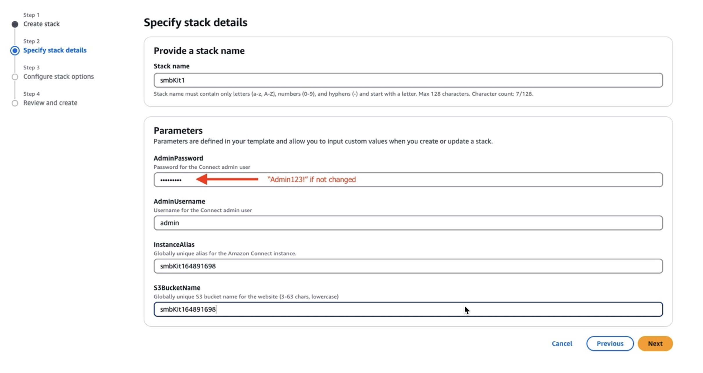

8.	Leave all selections as default and scroll down to Capabilities and select ‘I acknowledge that AWS CloudFormation might create IAM resources.’
9.	Click Next
10.	Leave all sections as is, scroll down to bottom of page and select Submit.
 	Your CloudFormation template will start deploying with status ‘CREATE_IN_PROGRESS.  This build process will take a 10-15minutes to deploy.
11.	When the CloudFormation is ‘CREATE_COMPLETE’ navigate to the Outputs tab and note down the FAQBucket, and S3Bucket names and the WebsiteURL.

### Set up Amazon Q Knowledge Base

1.	In the menu bar of the console, type in Amazon Connect and click Amazon Connect from the Services menu to navigate to the Amazon Connect AWS console.
2.	In the Amazon Connect console, click on the Instance alias name that was created during the deployment.
3.	In the left-hand menu, select Amazon Q.

 

4.	Select Add Domain > Create a new domain.  Enter a preferred domain name like “my-q-in-connect”.
5.	Select Create an AWS KMS Key. This will navigate to the Customer-managed keys page of the Key Management Service (KMS) console.  
6.	In the KMS console, on the Configure key page:  
    - Choose Key Type - Symmetric.  
    - Key Usage – Encrypt and decrypt.  
    - Click Next.

    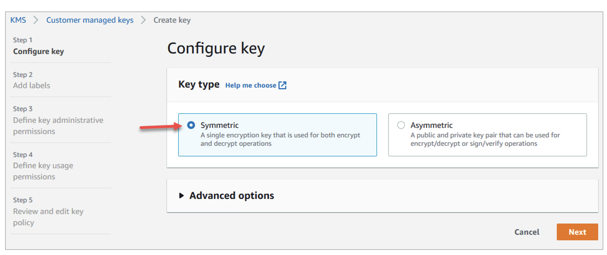 

    - On the Add labels page, enter a display name for your key in the Alias field and click Next.
    - On the Define key administrative permissions page, leave everything default and click Next.
    - On the Define key usage permissions page, leave everything default and click Next.
    - On the Edit key policy page.  Use the toggle button on the right-hand corner and move to ‘Edit’.
    - Copy and paste the updated key policy configuration below into the key policy.  Note; make sure you include your account number in the configuration before pasting into the Key policy
  
    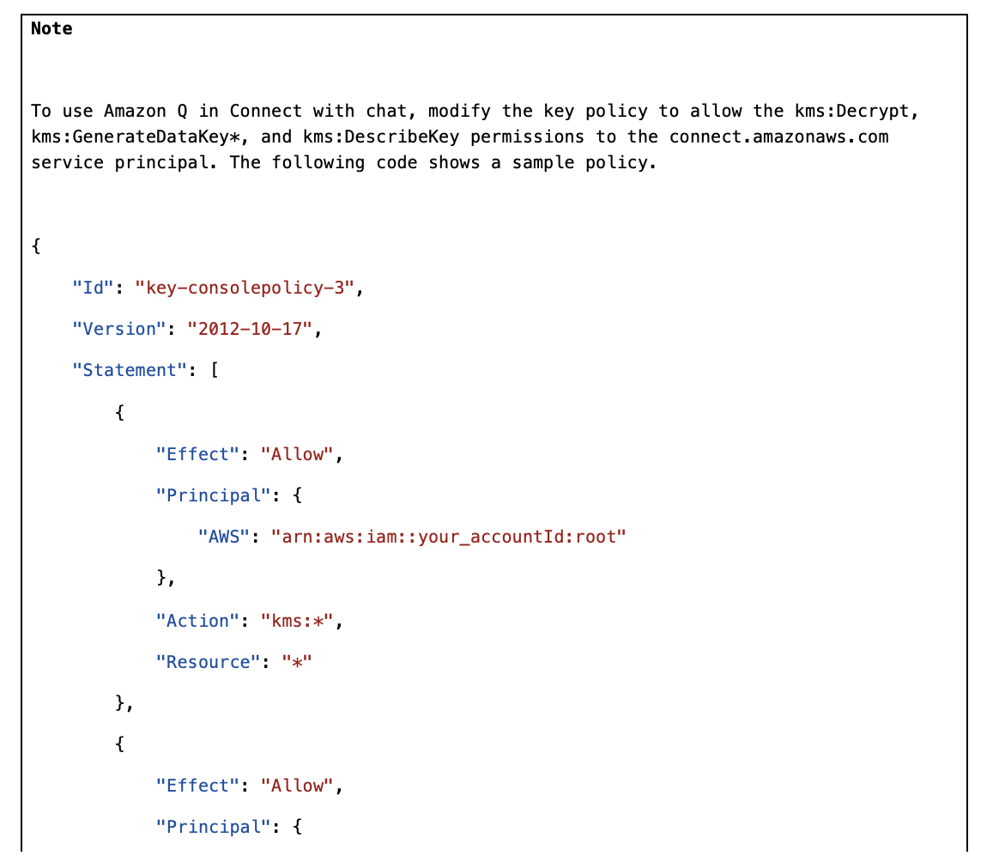 

    - When the policy has been updated, click Next
    - On the Review page scroll to the bottom of the page then click Finish

7.	Return to the AWS Amazon Connect console and the Amazon Q Add domain page.  Select the new KMS Key.  Click Add domain.
8.	On the same Amazon Q page, click on ‘Add integration’

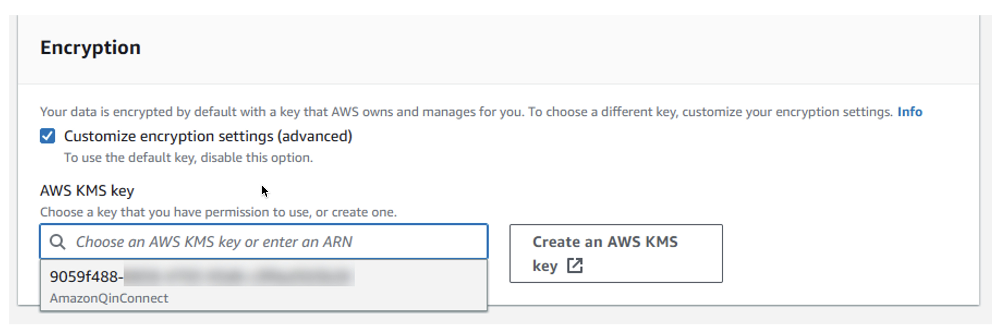 

9.	On the Add integration page, choose Create a new integration, and under Source select S3.
10.	Add an integration name of your choice.
11.	Under Connection with S3, click the Browse S3 button and search the bucket name created in previous CloudFormation step 6.c (FAQBucket). Select bucket and click choose.

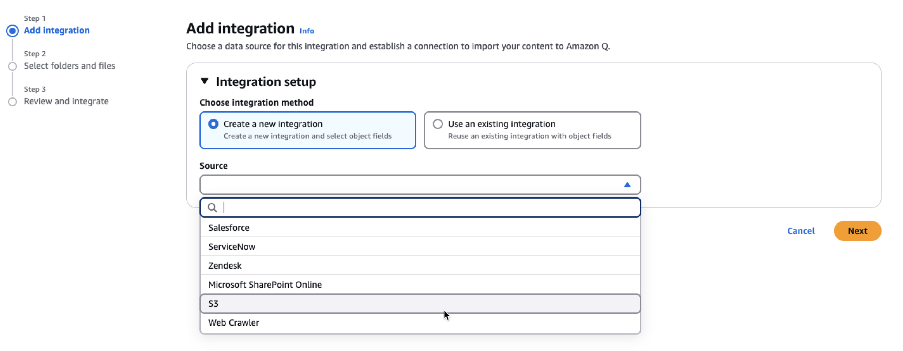 
  
13.	In the Encryption section, select the KMS Key you created previously.  
14.	Click: Next > Add integration

### Enable Lex Bot
1.	Navigate back to the Amazon Connect console and the new instance name.
2.	On the left-hand menu, at the bottom, click ‘Flows’
3.	Check both boxes under Amazon Lext Bots and click ‘Save’.  This provides the ability for the Lex bot to be created in the Amazon Connect Admin Console.

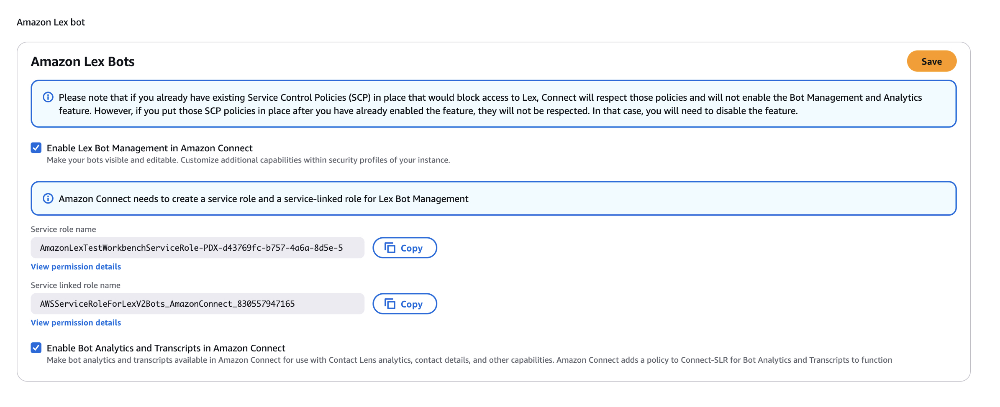 

4.	Navigate back to the Overview section of your Amazon Connect Instance by clicking the Instance Name in the top left corner.
5.	In the Access Information of the Account Overview, click on the Access URL link.
6.	This will take you to the Amazon Connect Admin console, use your username and password you entered when deploying your stack.  The default was username; Admin, Password, Admin123!

### Configure Lex Bot
1.	On the left-hand menu of the admin page, 
2.	Navigate to Routing > Flows > bots.
3.	Select Create Bot > call the bot “MenuBot”, leave the Children’s Online Privacy Protection Act (COPPA) as default setting > Click Create.
5.	Select Add language > English (US).
7.	In the Amazon Q in Connect intent section, Enable Amazon Q in Connect Intent.
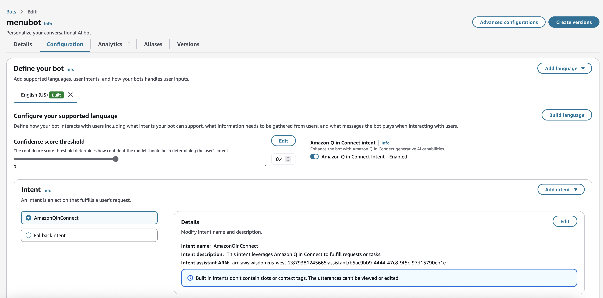 
9.	In the Enable Amazon Q in Connect intent pop-up window, select your bot from the drop down.  The bot’s name will start with arn:aws:wisdom.  Click Confirm.
 
11.	Click Build language

### Configure Contact Flow

1.	From Amazon Connect UI navigate to Routing > Flows.
2.	Select the -inboindFlow-_20250508_222550
3.	When the contact flow is opened, follow the instructions of the Note cards to update the flow blocks.
4.	Click Publish in the top right of the screen, you will see a ‘Flow published successfully!’ message in the top left of the screen confirming the change is complete.

### Configure Chat Widget

1.	From Amazon Connect UI navigate to Channels > Communication widgets > Add widget

2.	Add the following details:
    - Name: Enter a name of your choice
    - In the Chat contact flow, select the -inboindFlow-_20250508_222550 flow from the drop down.
    - Select the same flow for the Web calling contact flow
    - Click Save and continue
     

    
3.	On the Customise widget page, update the Define widget access button styles as follows:
    - Start chat icon background color: 0f1e5a
    - Icon Color – Leave White
    - Minimize chat icon background color: 0f1e5a
    - Icon Color - White

4.	Update the Widget Header with the following changes:
    - Header message, change to: 24/7 Support
    - Change Header color to: 0f1e5a
    - Leave widget background color as default: ffffff
    - Leave the Logo URL blank

5.	In the Chat view section, make the following changes:
    - Change the Typeface to Tahoma
    - In the System Message Display Name, hit the space bar (this removes the System Message)
    - In the Bot Message Display Name, hit the space bar (this removes the System Message)
    - IN the Text Input Placeholder, hit the space bar (this removes the System Message)
    - Change the Agent chat bubble color, to 6fa3d9
    - Change the Customer chat bubble color to bd9a62

    - Click Save and continue

6.	In the Domain & Security section make the following changes:
    - In the Add the required domains for the communication widget.  Paste the URL copied from the WebsiteURL CloudFormation stack
  
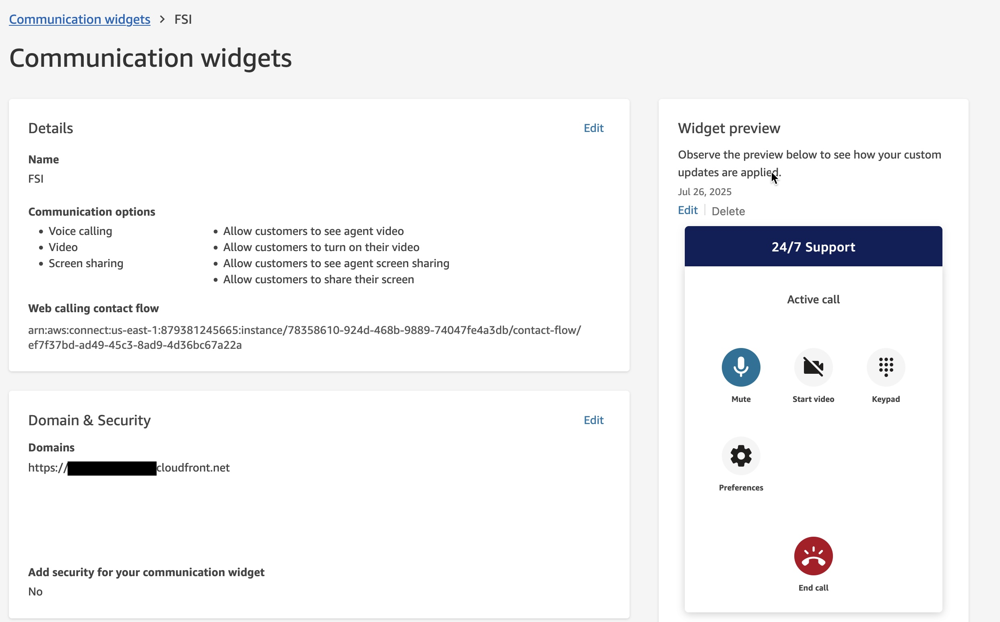 

    - In the Add security for new communication widget requests, change the Would you prefer to do this? To ‘No’
    - Click Save and continue

7.	On the final review page, select ‘Copy Script’.  This will copy the Widget Script.

### Configure Webpage 

1.	Login to your AWS account and navigate to S3.
2.	Search for the S3Bucket name noted down in step 11 Section CloudFormation Deployment.
3.	From the root folder, select the index.html file and click download.  
4.	Open the file using a text editor like Visual Code, delete lines 27 – 39.
5.	Paste the Widget script into the same file starting at line 27

 

6.	Save the file as index.html to your local machine
7.	Navigate back to the S3 bucket and add to new file updated file to the bucket.
8.	Click Upload.  This will overwrite the existing .html file

### Test your new self-service solution
You can access the deployed solution through the static webpage hosted on CloudFront.  
1.	Navigate to CloudFormation in the AWS Console.
2.	Select the stack name you created in step 3 of the Deployment Guide, CloudFormation section.
3.	Click on the Outputs tab, click on the WebsiteURL Key in the value column.  

 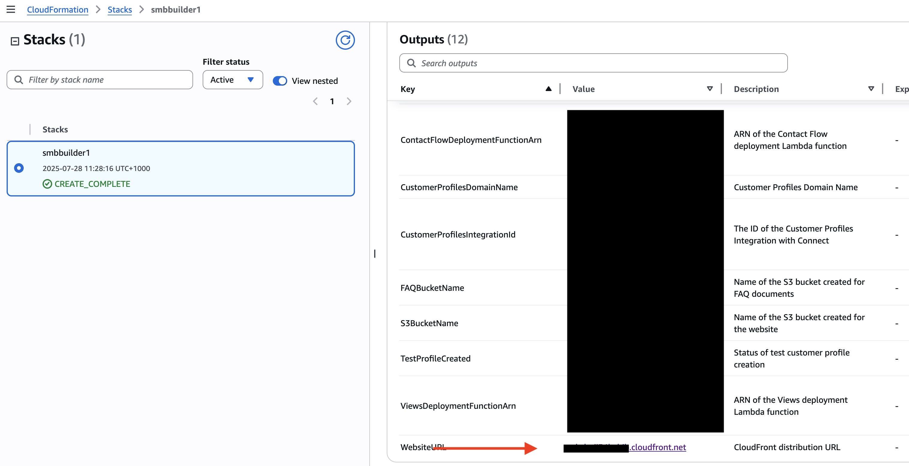 

4.	This is a test webpage of Any Business, select the test chat widget on the bottom right to start a chat. 

 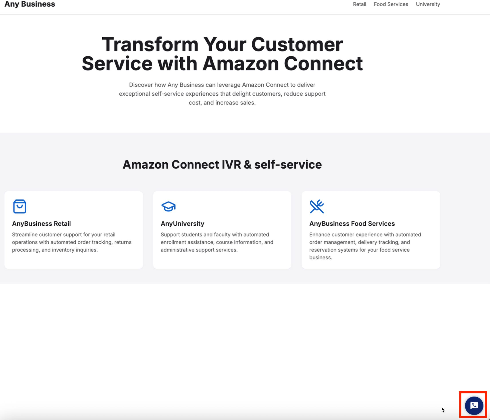 

5.	Customers can submit questions for self-service support. The FAQBucket includes a Word document containing frequently asked questions, which will be used as a reference for providing answers. For instructions on how to upload your own FAQ document, please see the next section, “Change FAQ document.”
    Example questions
    -	What is your return policy?
    -	How do I return an item?
    -	How can I contact support?
    -	Do you have a loyalty program?

 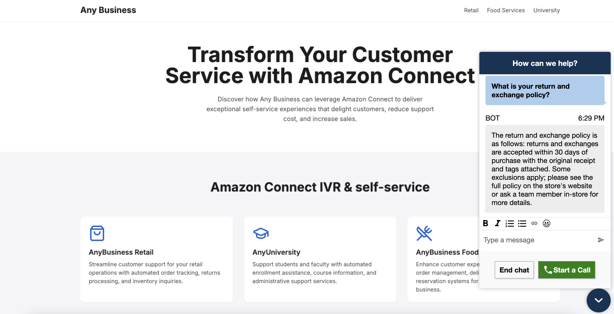 

_Note: Amazon Q is a generative AI-powered assistant that enables users to ask questions in natural language, without needing to match the exact wording found in company documents. If a user's question is related to information available in connected data sources, Amazon Q will understand the intent, identify relevant content, and provide an appropriate answer-even if the question is phrased differently than in the original document. For instance, if a document contains information about "What is your return and exchange policy?" and a customer asks, "I got my package and I want to return it," Amazon Q will recognize the connection and deliver the relevant answer. If the question is unrelated to any available information, Amazon Q will simply respond that it does not have an answer._

6.	At any stage the agent can say “speak to an agent” to be transferred to an agent via chat.
7.	Log the agent into Amazon Connect and set status to ready to accept the chat.

 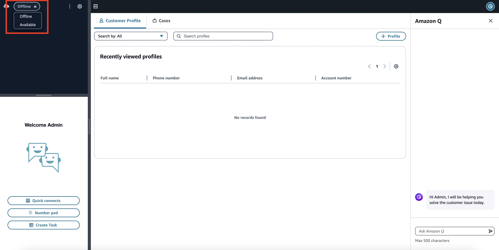 

8.	Customers can move to voice > video and screenshare by select start call and enabling their camera.

 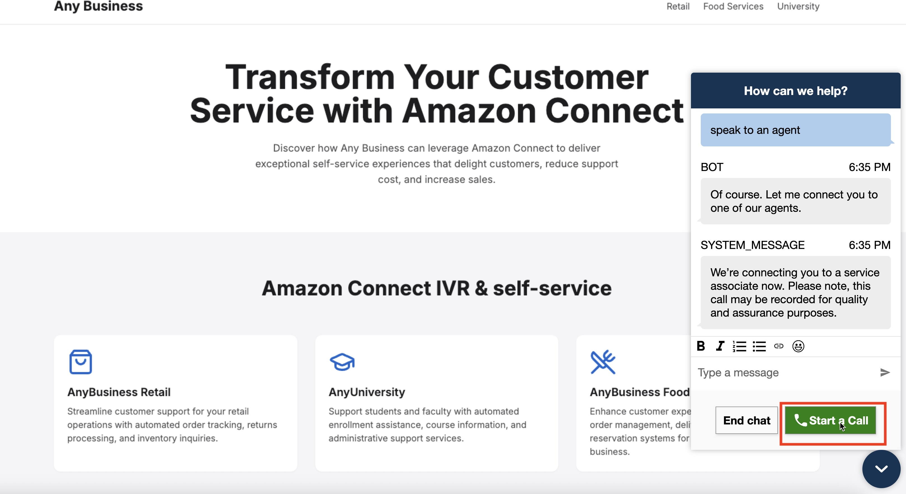 

### How to update the FAQ document with your own data
1.	Login to your AWS account were you deployed the CloudFormation template.
2.	Navigate to CloudFormation.
3.	Select the stack name > Outputs and copy the FAQBucketName

 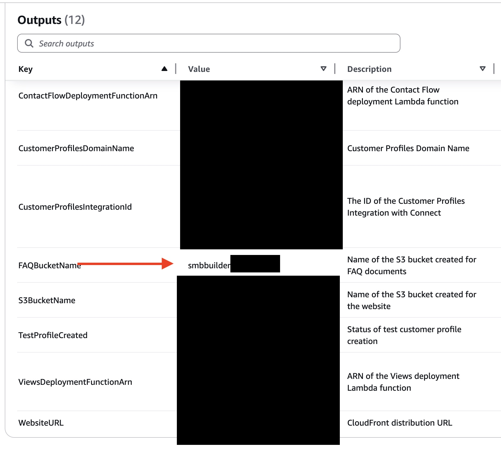 

4.	Navigate to S3 and search for the bucket name.

 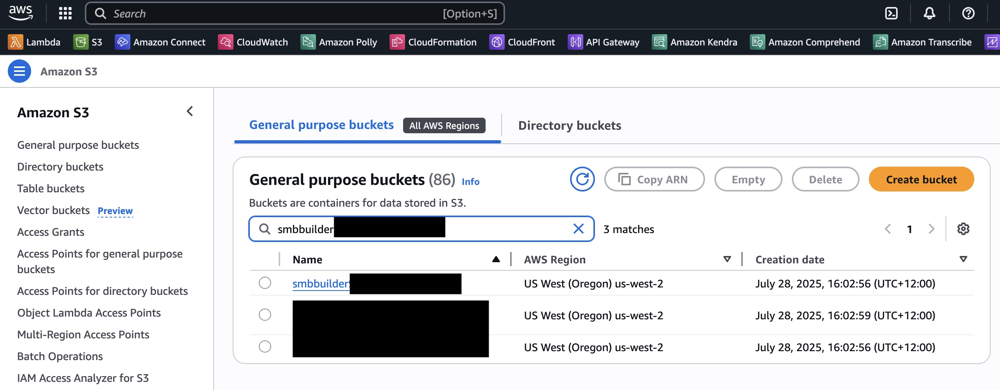 

5.	The bucket will contain a single file. Please delete this file and upload your own document containing FAQ questions and answers.
    Note: Your document must meet the following requirements:
    - Accepted formats: plain text (.txt), Word document (.docx), or PDF (.pdf)
    - File size must be less than 1 MB
    - Only include text-remove any images, as Generative AI only processes text

 
## Summary 

This guide provides step-by-step instructions to deploy an Amazon Connect self-service customer experience solution.   Upon completion you will have a GenAI chat bot with web calling capability, and an OMNI Channel contact centre.

By following this implementation, you will have:
1.	An Amazon Connect Instance built and configured in your AWS Account.  
2.	A self-service chat bot leveraging Bedrock knowledge base to answer customer queries.
3.	A webRTC calling capability to speak with human agents
4.	A hosted Web App via AWS CloudFront to experience the deployed solution.

